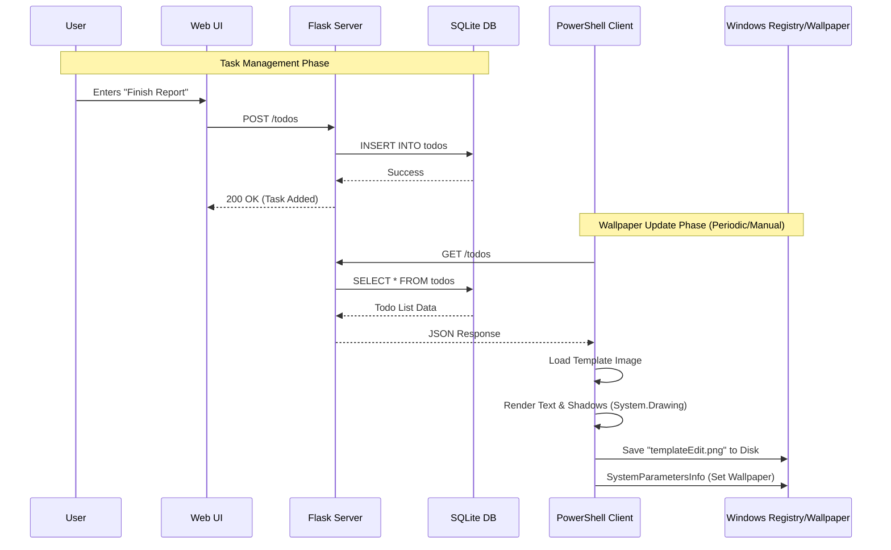

# Project Overview

## Executive Summary
**DesktopBackground** is a productivity tool that integrates task management directly into the user's desktop environment. By dynamically embedding a user's TODO list into the desktop wallpaper, it ensures that critical tasks remain visible, reducing context switching and improving focus. It utilizes a hybrid architecture with a lightweight Python web server for data management and a native PowerShell script for Windows desktop integration.

## System Architecture

The following sequence diagram illustrates the end-to-end workflow from a user adding a task to the wallpaper being updated.

## Technical Stack

### Backend (Server)
*   **Language**: Python 3.x
*   **Framework**: Flask (Micro web framework)
*   **Database**: SQLite (Zero-configuration SQL database engine)
*   **Libraries**:
    *   `flask-cors`: Handles Cross-Origin Resource Sharing for API security.
    *   `sqlite3`: Python standard library interface for SQLite.

### Frontend (User Interface)
*   **HTML5/CSS3**: Simple, responsive web interface for task entry.
*   **Jinja2**: Templating engine for server-side rendering.

### Integration (Client)
*   **Scripting**: PowerShell 5.1+
*   **Graphics**: `.NET System.Drawing` Namespace (GDI+)
    *   Used for pixel-perfect text rendering, custom fonts ("Cooper Hewitt"), and shadow effects.
*   **OS API**: `user32.dll` (`SystemParametersInfo`)
    *   Direct WIN32 API call to change the desktop wallpaper without third-party tools.

## Data Flow
1.  **Input**: User inputs data via the web interface (`http://localhost:5000`).
2.  **Storage**: Data is persisted in `todos.db` (SQLite) with fields: `id`, `task`, `priority`.
3.  ** retrieval**: PowerShell client polls the `/todos` endpoint.
4.  **Processing**:
    *   Client iterates through the JSON list.
    *   High-priority items are assigned a Red brush; others are Black.
    *   Text is drawn with a slight offset (gray brush) first to create a drop-shadow effect.
5.  **Output**: A finalized `.png` image is generated and applied to the Windows User Profile.

## Future Roadmap
*   **Hardware Acceleration**: Move from GDI+ to Direct2D for faster image processing.
*   **Multi-Monitor Support**: Generate separate wallpapers for different screens.
*   **Time-Based Triggers**: Automatically refresh wallpaper at specific intervals (e.g., every hour).
*   **Cloud Sync**: Migrate from local SQLite to a cloud database (e.g., Firebase/Postgres) for multi-device sync.
